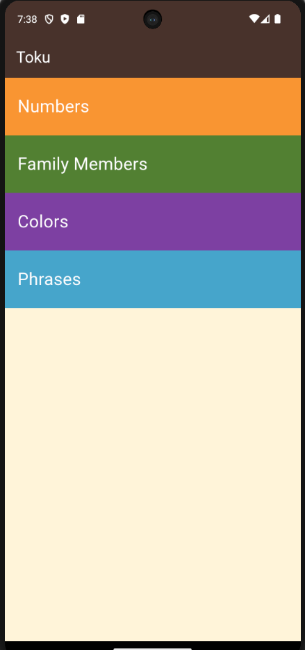
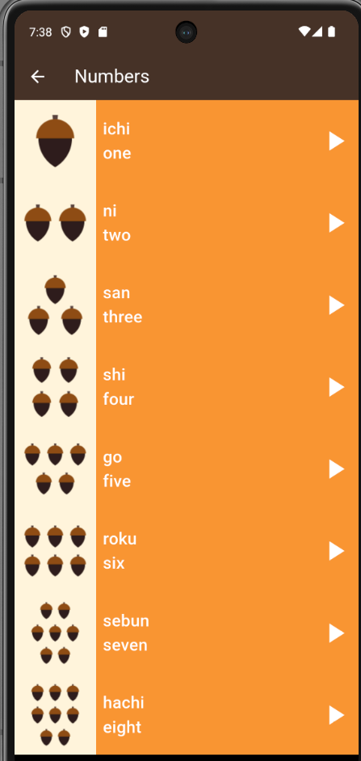
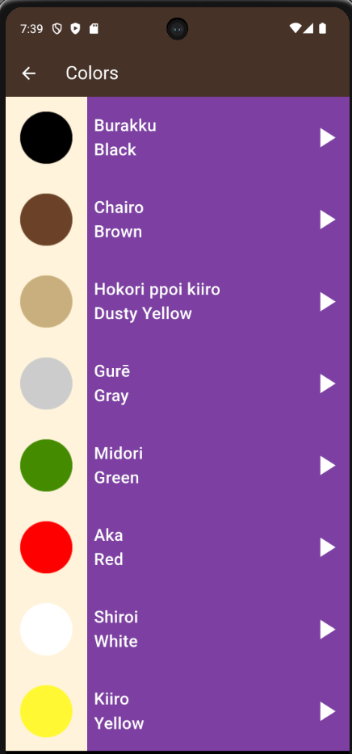
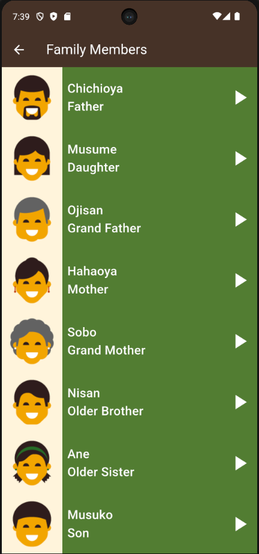
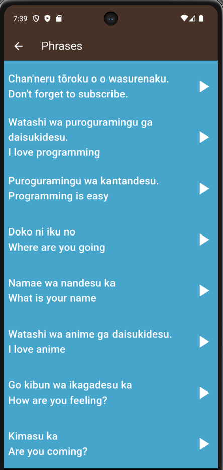

# 🇯🇵 Toku App

A Flutter-based Japanese language learning application designed to help beginners learn basic Japanese vocabulary through visual content and audio pronunciation.

This project was built as part of my Flutter learning journey to practice Flutter UI development, reusable widgets, OOP, navigation, lists, and audio integration.

---

## 📱 About the App

Toku is a simple educational application that organizes Japanese vocabulary into different categories.
Users can select a category and browse vocabulary items with:

- 🖼️ Images
- 🇯🇵 Japanese names
- 🇬🇧 English translations
- 🔊 Japanese pronunciation audio

The application focuses on keeping the UI simple and making the learning experience easy to follow.

---

## ✨ Features

- 📚 Vocabulary organized into categories
- 🔢 Numbers learning section
- 👨‍👩‍👧 Family members section
- 🎨 Colors section
- 💬 Common phrases section
- 🔊 Audio pronunciation for vocabulary items
- 🧭 Navigation between different screens
- 📜 Scrollable vocabulary lists
- ♻️ Reusable custom widgets
- 📦 Object-oriented data models

---

## 🛠️ Technologies & Tools

- **Framework:** Flutter
- **Language:** Dart
- **Design:** Material Design
- **Packages:** `audioplayers`
- **IDEs:** Android Studio, VS Code
- **VCS:** Git & GitHub

---

## 🧠 Flutter Concepts Practiced

While building this project, I practiced and applied several important Flutter concepts:

### Widgets
- `StatelessWidget`
- `StatefulWidget`
- Custom Widgets
- Widget composition & Widget tree

### Layout & UI
- `Column`, `Row`, `Container`
- `ListView`, `ListView.builder`
- `Image`, `Text`
- `GestureDetector`

### Navigation
- `Navigator.push`
- `MaterialPageRoute`
- Passing data between widgets/pages

### Dart & OOP
- Classes, Objects, Constructors
- Named parameters
- Object-based data modeling

### Reusability
The application uses reusable widgets to avoid repeating the same UI structure across different vocabulary items and categories. For example, vocabulary data is represented using Dart objects and passed to reusable item widgets instead of hardcoding every item separately.

---

## 📂 Project Structure

The project is organized into separate directories for models, reusable components, and application screens:

```text
lib/
├── Components/
│   ├── category_items.dart
│   └── list_items.dart
│
├── Model/
│   └── items.dart
│
├── screens/
│   ├── colors_page.dart
│   ├── family_members.dart
│   ├── home_page.dart
│   ├── numbers_page.dart
│   └── phrases_page.dart
│
└── main.dart

🔊 Audio
The application uses the audioplayers package to play Japanese pronunciation audio for vocabulary items. This allows users to connect the written vocabulary with its pronunciation.


🧩 What I Learned
Building Toku helped me move beyond creating static Flutter screens and start thinking about how Flutter applications are structured. Some of the key lessons were:

How to create reusable custom widgets.

How to represent application data using Dart classes.

How to pass objects between widgets.

How to build dynamic lists instead of manually creating every item.

How navigation works between Flutter screens.

How to connect UI interactions with application behavior.

How to integrate a third-party Flutter package.

How to debug Android/Gradle issues during package integration.

How to organize Flutter code into separate components and screens.


🚀 What I Practiced Through This Project
The main goal of this project was not only to reproduce the UI. I used it to practice the following development flow:

Plaintext
UI Design
   ↓
UI Analysis
   ↓
Widget Tree
   ↓
Flutter Implementation
   ↓
Data Modeling
   ↓
Reusable Components
   ↓
Navigation
   ↓
Dynamic Lists
   ↓
Audio Integration
   ↓
Debugging & Refactoring


📸 Screenshots
## 📸 Screenshots

<p float="left">
  
  
  
  
  
</p>


🎯 Learning Status
This project was built during my journey toward becoming a Junior Flutter Developer.
The next step after completing this project is to build an independent Flutter Mini Project from scratch using the concepts learned here, rather than simply rebuilding Toku.

👨‍💻 Author
Abdallah Mohammed

Flutter Developer | Dart | Cross-Platform Mobile Development

GitHub: Abdallah22796[https://github.com/Abdallah22796]

LinkedIn: Abdallah Mohammed[www.linkedin.com/in/abdallah23]

📌 Learning Journey
Part of my Flutter learning journey and practical project development.

Flutter → Practice → Mini Projects → Portfolio → Junior Flutter Developer
